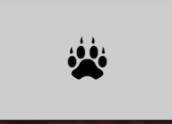
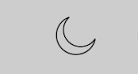

# jabir-omar.github.io
# Aniaml Zoo Website

Here are some Features of this Webpage

* Diffrent Animals with there **Images**.
* Awesome **facts** about Animals.
* The website is **responsive**. It's mobile, laptop and desktop friendly  
* You can use **Dark** or **Bright theme**. 

# Landing Page

The Landing page is the first thing which will appear on screen it consist some features such as :

* The Website logo.
* Four different titles.
* Theme changer.
* About me.

## **If you you are using a wide Screen the landing page will look like this**

If you look at the left top corner you will see the **logo** 

The logo has EventListner or it scrolls the page to the top. which means if you are on bottom or in the middle and click this logo the page will **Automatically scroll to the top**.

If you look top center you will see the **four titles**

You can click which ever you want and the page will Automatically scroll untill you reach the destination.

If you look at top right corner you will see the **Theme changer** and **About me**

The moon shape icon is the Theme changer it has Click event when click that moon the whole webpage theme will be changed from **bright to dark**

The next is **About Me**

